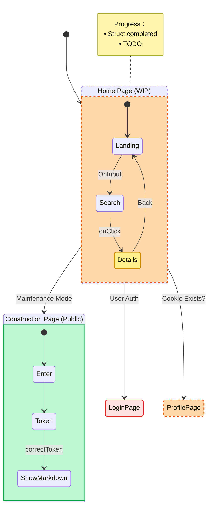

# v0.1.0 - 2023-10-20 [update-Albatross] 🐦

The very first update

## 🚀 New Features
### Pages
- [Home Page](/home) `[WIP]` - Basic layout placeholder
- [Construction Page](/under-construction) `[Public]` - Maintenance notice page

## 🛠️ Improvements
- Optimized project initialization process

## Legend
- `[Auth]` `Red` Requires authorization *(access token needed)*
- `[Public]` `Green` Open to all visitors
- `[WIP]` `Orange` Work in progress
- `[Beta]` `Yellow` Experimental feature

## Current/planned State Diagram
